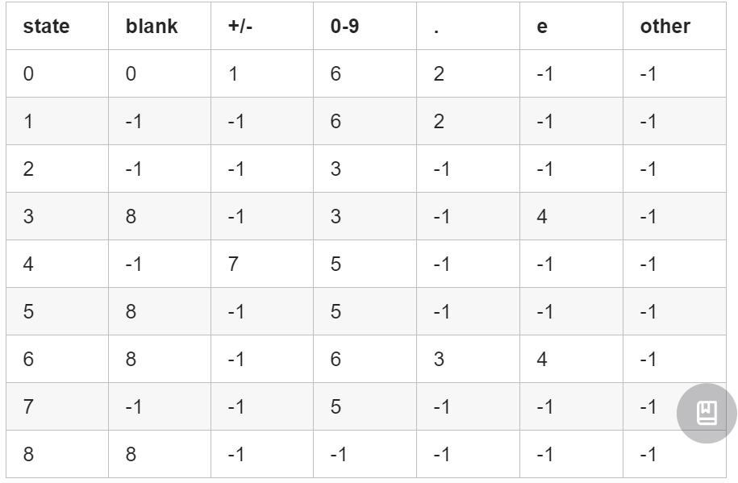
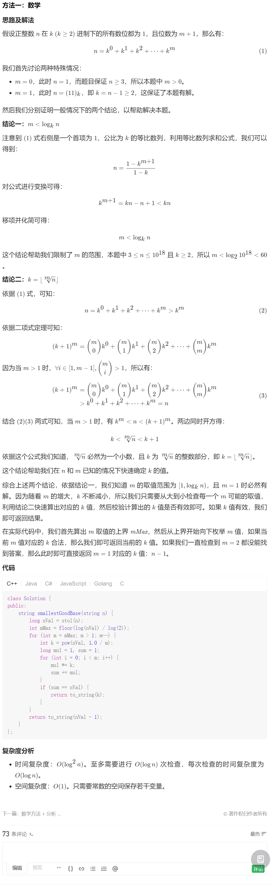

[TOC]

# 数组

## 209.长度最小的子数组

题目链接： [209. 长度最小的子数组 - 力扣（LeetCode） (leetcode-cn.com)](https://leetcode-cn.com/problems/minimum-size-subarray-sum/)

给定一个含有 n 个正整数的数组和一个正整数 s ，找出该数组中满足其和 ≥ s 的长度最小的 连续 子数组，并返回其长度。如果不存在符合条件的子数组，返回 0。

示例：

输入：s = 7, nums = [2,3,1,2,4,3] 输出：2 解释：子数组 [4,3] 是该条件下的长度最小的子数组。

### 1. 滑动窗口法


### 2. hash法

就是每遍历到一个数，就判断在不在map中，不在的话，把target-nums[i]放入map，如果以后再找到新的就把新的放进去，遍历结束就找到了。缺点在于比滑动窗口法空间复杂度大。

# 链表

## 19.删除链表的倒数第N个节点

[19. 删除链表的倒数第 N 个结点 - 力扣（LeetCode） (leetcode-cn.com)](https://leetcode-cn.com/problems/remove-nth-node-from-end-of-list/)

给你一个链表，删除链表的倒数第 n 个结点，并且返回链表的头结点。

进阶：你能尝试使用一趟扫描实现吗？

### 双指针法

让fast移动k步，然后让fast和slow同时移动，直到fast指向链表末尾。删掉slow所指向的节点就可以了。

同时配合虚拟头结点，可以简化头结点的处理逻辑。

### 队列法

队列法就是创造一个队列，每访问一个结点就放进队列没如果队列长度超过k就把第一个弹出，这样就方便地得到了第k个的前缀。实际上就是双指针法的变形，空间时间上不如双指针法

## 142.环形链表II

[142. 环形链表 II - 力扣（LeetCode） (leetcode-cn.com)](https://leetcode-cn.com/problems/linked-list-cycle-ii/)

题意： 给定一个链表，返回链表开始入环的第一个节点。 如果链表无环，则返回 null。

为了表示给定链表中的环，使用整数 pos 来表示链表尾连接到链表中的位置（索引从 0 开始）。 如果 pos 是 -1，则在该链表中没有环。

**说明**：不允许修改给定的链表。


### 快慢指针法

 分别定义 fast 和 slow指针，从头结点出发，fast指针每次移动两个节点，slow指针每次移动一个节点，如果 fast 和 slow指针在途中相遇 ，说明这个链表有环。

**此时已经可以判断链表是否有环了，那么接下来要找这个环的入口了。**

假设从头结点到环形入口节点 的节点数为x。 环形入口节点到 fast指针与slow指针相遇节点 节点数为y。 从相遇节点 再到环形入口节点节点数为 z。 如图所示：


对于slow：x+y

对于fast：x+y+z+y

也就是说: 2(x+y)=x+y+z+y

即z=x

所以定义一个新指针从头和在当前位置的slow同时出发，他们会在环的入口相遇。

### map法

好理解，不解释了，不如快慢指针法

# Hash表

## 第454题.四数相加II

[454. 四数相加 II - 力扣（LeetCode） (leetcode-cn.com)](https://leetcode-cn.com/problems/4sum-ii/)

给定四个包含整数的数组列表 A , B , C , D ,计算有多少个元组 (i, j, k, l) ，使得 A[i] + B[j] + C[k] + D[l] = 0。

为了使问题简单化，所有的 A, B, C, D 具有相同的长度 N，且 0 ≤ N ≤ 500 。所有整数的范围在 -2^28 到 2^28 - 1 之间，最终结果不会超过 2^31 - 1 。

找出A、B的所有组合放入map，在遍历C、D的所有组合

把时间复杂度从 n^4 降低到了 n^2

## 第15题. 三数之和

[15. 三数之和 - 力扣（LeetCode） (leetcode-cn.com)](https://leetcode-cn.com/problems/3sum/)

给你一个包含 n 个整数的数组 nums，判断 nums 中是否存在三个元素 a，b，c ，使得 a + b + c = 0 ？请你找出所有满足条件且不重复的三元组。

**注意：** 答案中不可以包含重复的三元组。

hash解法实际上比较复杂，我们这里使用双指针法

### 双指针法


拿这个nums数组来举例，首先将数组排序，然后有一层for循环，i从下表0的地方开始，同时定一个下表left 定义在i+1的位置上，定义下表right 在数组结尾的位置上。

依然还是在数组中找到 abc 使得a + b +c =0，我们这里相当于 a = nums[i] b = nums[left] c = nums[right]。

接下来如何移动left 和right呢， 如果nums[i] + nums[left] + nums[right] > 0 就说明 此时三数之和大了，因为数组是排序后了，所以right下表就应该向左移动，这样才能让三数之和小一些。

如果 nums[i] + nums[left] + nums[right] < 0 说明 此时 三数之和小了，left 就向右移动，才能让三数之和大一些，直到left与right相遇为止。

### 进阶

两数之和就不能使用双指针法，因为[1.两数之和](https://mp.weixin.qq.com/s/vaMsLnH-f7_9nEK4Cuu3KQ)要求返回的是索引下表， 而双指针法一定要排序，一旦排序之后原数组的索引就被改变了。

可是如果三数之和也要求返回索引呢？那我们其实只需要先对数组加入一次map，value是index就可以了。

# 字符串

## 151.翻转字符串里的单词

[151. 翻转字符串里的单词 - 力扣（LeetCode） (leetcode-cn.com)](https://leetcode-cn.com/problems/reverse-words-in-a-string/)

给定一个字符串，逐个翻转字符串中的每个单词。

示例 1： 输入: "the sky is blue" 输出: "blue is sky the"

示例 2： 输入: "  hello world!  " 输出: "world! hello" 解释: 输入字符串可以在前面或者后面包含多余的空格，但是反转后的字符不能包括。

示例 3： 输入: "a good  example" 输出: "example good a" 解释: 如果两个单词间有多余的空格，将反转后单词间的空格减少到只含一个。

**不要使用辅助空间，空间复杂度要求为O(1)。**

解题思路如下：

- 移除多余空格
- 将整个字符串反转
- 将每个单词反转

## 剑指Offer58-II.左旋转字符串

[剑指 Offer 58 - II. 左旋转字符串 - 力扣（LeetCode） (leetcode-cn.com)](https://leetcode-cn.com/problems/zuo-xuan-zhuan-zi-fu-chuan-lcof/)

不能使用额外空间的话，模拟在本串操作要实现左旋转字符串的功能还是有点困难的。

具体步骤为：

1. 反转区间为前n的子串
2. 反转区间为n到末尾的子串
3. 反转整个字符串

## KMP算法

参考文章：[(1条消息) 数据结构KMP算法配图详解（超详细）_哈顿之光的博客-CSDN博客_数据结构kmp算法](https://blog.csdn.net/weixin_46007276/article/details/104372119?ops_request_misc=%7B%22request%5Fid%22%3A%22162296968516780264015520%22%2C%22scm%22%3A%2220140713.130102334..%22%7D&request_id=162296968516780264015520&biz_id=0&utm_medium=distribute.pc_search_result.none-task-blog-2~all~top_positive~default-1-104372119.first_rank_v2_pc_rank_v29&utm_term=KMP算法&spm=1018.2226.3001.4187)

[leetcode-master/0028.实现strStr.md](https://github.com/youngyangyang04/leetcode-master/blob/master/problems/0028.实现strStr.md)

[字符串：听说你对KMP有这些疑问？ (qq.com)](https://mp.weixin.qq.com/s/mqx6IM2AO4kLZwvXdPtEeQ)

## 459.重复的子字符串

给定一个非空的字符串，判断它是否可以由它的一个子串重复多次构成。给定的字符串只含有小写英文字母，并且长度不超过10000。

示例 1: 输入: "abab" 输出: True 解释: 可由子字符串 "ab" 重复两次构成。

示例 2: 输入: "aba" 输出: False

示例 3: 输入: "abcabcabcabc" 输出: True 解释: 可由子字符串 "abc" 重复四次构成。 (或者子字符串 "abcabc" 重复两次构成。)

### KMP算法

这又是一道标准的KMP的题目。在一个串中查找是否出现过另一个串，这是KMP的看家本领。

那么寻找重复子串怎么也涉及到KMP算法了呢？

这里就要说一说next数组了，next 数组记录的就是最长相同前后缀。 如果 next[len - 1] != -1，则说明字符串有最长相同的前后缀（就是字符串里的前缀子串和后缀子串相同的最长长度）。

最长相等前后缀的长度为：next[len - 1] + 1。

数组长度为：len。

如果len % (len - (next[len - 1] + 1)) == 0 ，则说明 (数组长度-最长相等前后缀的长度) 正好可以被 数组的长度整除，说明有该字符串有重复的子字符串。

**数组长度减去最长相同前后缀的长度相当于是第一个周期的长度，也就是一个周期的长度，如果这个周期可以被整除，就说明整个数组就是这个周期的循环。**

**强烈建议大家把next数组打印出来，看看next数组里的规律，有助于理解KMP算法**

如图：

[]()

next[len - 1] = 7，next[len - 1] + 1 = 8，8就是此时字符串asdfasdfasdf的最长相同前后缀的长度。

(len - (next[len - 1] + 1)) 也就是： 12(字符串的长度) - 8(最长公共前后缀的长度) = 4， 4正好可以被 12(字符串的长度) 整除，所以说明有重复的子字符串（asdf）。

## TODO

双指针法第一篇

# 有限自动机

## 有效数字

题目链接：[65. 有效数字 - 力扣（LeetCode） (leetcode-cn.com)](https://leetcode-cn.com/problems/valid-number/)


本题可以采用《编译原理》里面的确定的有限状态机（DFA）解决。构造一个DFA并实现，构造方法可以先写正则表达式，然后转为 DFA，也可以直接写，我就是直接写的，虽然大概率不会是最简结构（具体请参考《编译器原理》图灵出版社），不过不影响解题。DFA 作为确定的有限状态机，比 NFA 更加实用，因为对于每一个状态接收的下一个字符，DFA 能确定唯一一条转换路径，所以使用简单的表驱动的一些方法就可以实现，并且只需要读一遍输入流，比起 NFA 需要回读在速度上会有所提升。

构建出来的状态机如封面图片所示（红色为 终止状态，蓝色为 中间状态）。根据《编译原理》的解释，DFA 从状态 0 接受串 s 作为输入。当s耗尽的时候如果当前状态处于中间状态，则拒绝；如果到达终止状态，则接受。

然后，根据 DFA 列出如下的状态跳转表，之后我们就可以采用 表驱动法 进行编程实现了。需要注意的是，这里面多了一个状态 8，是用于处理串后面的若干个多余空格的。所以，所有的终止态都要跟上一个状态 8。其中，有一些状态标识为-1，是表示遇到了一些意外的字符，可以直接停止后续的计算。状态跳转表如下：



状态图：


```java
class Solution {
    public int make(char c) {
        switch(c) {
            case ' ': return 0;
            case '+':
            case '-': return 1;
            case '.': return 3;
            case 'e': return 4;
            default:
                if(c >= 48 && c <= 57) return 2;
        }
        return -1;
    }
    
    public boolean isNumber(String s) {
        int state = 0;
        int finals = 0b101101000;
        int[][] transfer = new int[][]{{ 0, 1, 6, 2,-1},
                                       {-1,-1, 6, 2,-1},
                                       {-1,-1, 3,-1,-1},
                                       { 8,-1, 3,-1, 4},
                                       {-1, 7, 5,-1,-1},
                                       { 8,-1, 5,-1,-1},
                                       { 8,-1, 6, 3, 4},
                                       {-1,-1, 5,-1,-1},
                                       { 8,-1,-1,-1,-1}};
        char[] ss = s.toCharArray();
        for(int i=0; i < ss.length; ++i) {
            int id = make(ss[i]);
            if (id < 0) return false;
            state = transfer[state][id];
            if (state < 0) return false;
        }
        return (finals & (1 << state)) > 0;
    }
}
```


# LeetCode自主刷题

## 数学题

### 最小好进制

[483. 最小好进制 - 力扣（LeetCode） (leetcode-cn.com)](https://leetcode-cn.com/problems/smallest-good-base/)

对于给定的整数 n, 如果n的k（k>=2）进制数的所有数位全为1，则称 k（k>=2）是 n 的一个好进制。

以字符串的形式给出 n, 以字符串的形式返回 n 的最小好进制。

示例 1：

输入："13"
输出："3"
解释：13 的 3 进制是 111。
示例 2：

输入："4681"
输出："8"
解释：4681 的 8 进制是 11111。
示例 3：

输入："1000000000000000000"
输出："999999999999999999"
解释：1000000000000000000 的 999999999999999999 进制是 11。


提示：

n的取值范围是 [3, 10^18]。
输入总是有效且没有前导 0。


**题解**



